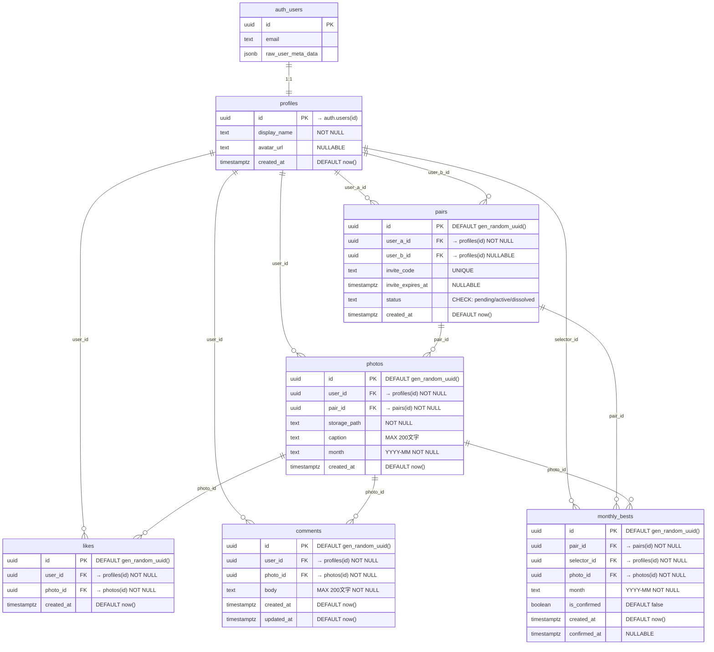

# Photop DB設計書

## 1. ER図

---

## 2. テーブル定義

### 2.1 profiles — ユーザープロフィール

| カラム | 型 | 制約 | 説明 |
|--------|-----|------|------|
| id | uuid | PK, FK → auth.users(id), ON DELETE CASCADE | ユーザーID |
| display_name | text | NOT NULL | 表示名 |
| avatar_url | text | NULLABLE | アバター画像URL |
| created_at | timestamptz | NOT NULL, DEFAULT now() | 作成日時 |

### 2.2 pairs — ペアリング管理

| カラム | 型 | 制約 | 説明 |
|--------|-----|------|------|
| id | uuid | PK, DEFAULT gen_random_uuid() | ペアID |
| user_a_id | uuid | NOT NULL, FK → profiles(id), ON DELETE CASCADE | 招待者 |
| user_b_id | uuid | NULLABLE, FK → profiles(id), ON DELETE CASCADE | 参加者（参加前はNULL） |
| invite_code | text | UNIQUE | 招待コード（6桁英数字） |
| invite_expires_at | timestamptz | NULLABLE | 招待コード有効期限 |
| status | text | NOT NULL, DEFAULT 'pending', CHECK | ステータス |
| created_at | timestamptz | NOT NULL, DEFAULT now() | 作成日時 |

**status の取りうる値**: `pending`（招待中） / `active`（ペア成立） / `dissolved`（解除済み）

### 2.3 photos — 写真投稿

| カラム | 型 | 制約 | 説明 |
|--------|-----|------|------|
| id | uuid | PK, DEFAULT gen_random_uuid() | 写真ID |
| user_id | uuid | NOT NULL, FK → profiles(id), ON DELETE CASCADE | 投稿者 |
| pair_id | uuid | NOT NULL, FK → pairs(id), ON DELETE CASCADE | 所属ペア |
| storage_path | text | NOT NULL | Storageファイルパス |
| caption | text | CHECK(<=200文字) | キャプション |
| month | text | NOT NULL | 投稿月（YYYY-MM） |
| created_at | timestamptz | NOT NULL, DEFAULT now() | 投稿日時 |

### 2.4 likes — いいね

| カラム | 型 | 制約 | 説明 |
|--------|-----|------|------|
| id | uuid | PK, DEFAULT gen_random_uuid() | いいねID |
| user_id | uuid | NOT NULL, FK → profiles(id), ON DELETE CASCADE | いいねした人 |
| photo_id | uuid | NOT NULL, FK → photos(id), ON DELETE CASCADE | 対象写真 |
| created_at | timestamptz | NOT NULL, DEFAULT now() | いいね日時 |

**一意制約**: `UNIQUE(user_id, photo_id)` — 同じ写真に二重いいね不可

### 2.5 comments — コメント

| カラム | 型 | 制約 | 説明 |
|--------|-----|------|------|
| id | uuid | PK, DEFAULT gen_random_uuid() | コメントID |
| user_id | uuid | NOT NULL, FK → profiles(id), ON DELETE CASCADE | 投稿者 |
| photo_id | uuid | NOT NULL, FK → photos(id), ON DELETE CASCADE | 対象写真 |
| body | text | NOT NULL, CHECK(<=200文字) | コメント本文 |
| created_at | timestamptz | NOT NULL, DEFAULT now() | 投稿日時 |
| updated_at | timestamptz | NOT NULL, DEFAULT now() | 更新日時 |

### 2.6 monthly_bests — 月間ベスト選出

| カラム | 型 | 制約 | 説明 |
|--------|-----|------|------|
| id | uuid | PK, DEFAULT gen_random_uuid() | レコードID |
| pair_id | uuid | NOT NULL, FK → pairs(id), ON DELETE CASCADE | 所属ペア |
| selector_id | uuid | NOT NULL, FK → profiles(id), ON DELETE CASCADE | 選出者 |
| photo_id | uuid | NOT NULL, FK → photos(id), ON DELETE CASCADE | 選出された写真 |
| month | text | NOT NULL | 対象月（YYYY-MM） |
| is_confirmed | boolean | NOT NULL, DEFAULT false | 確定フラグ |
| created_at | timestamptz | NOT NULL, DEFAULT now() | 選出日時 |
| confirmed_at | timestamptz | NULLABLE | 確定日時 |

**一意制約**: `UNIQUE(pair_id, selector_id, month)` — 1ペア内で1人が1月に1枚のみ選出

---

## 3. インデックス一覧

| テーブル | インデックス名 | カラム | 条件 |
|---------|---------------|--------|------|
| pairs | idx_pairs_invite_code | invite_code | WHERE status = 'pending' |
| pairs | idx_pairs_user_a | user_a_id | — |
| pairs | idx_pairs_user_b | user_b_id | — |
| photos | idx_photos_pair_month | pair_id, month | — |
| photos | idx_photos_user | user_id | — |
| likes | idx_likes_photo | photo_id | — |
| comments | idx_comments_photo | photo_id | — |
| monthly_bests | idx_monthly_bests_pair_month | pair_id, month | — |

---

## 4. RLSポリシー概要

| テーブル | SELECT | INSERT | UPDATE | DELETE |
|---------|--------|--------|--------|--------|
| profiles | 自分 + ペア相手 | 自分のIDのみ | 自分のみ | — |
| pairs | 当事者のみ | user_a=自分 | 当事者のみ | — |
| photos | ペアの2人 | 自分のuser_id + 自分のpair_id | — | 投稿者のみ |
| likes | ペア内の写真 | 相手の写真のみ | — | 自分のいいねのみ |
| comments | ペア内の写真 | ペア内の写真 | 自分のコメント | 自分のコメント |
| monthly_bests | 確定済み=ペア、未確定=選出者 | 自分のペア内 | 選出者(未確定のみ) | 選出者(未確定のみ) |

---

## 5. RPC関数・トリガー

### RPC関数

| 関数名 | 引数 | 戻り値 | 説明 |
|--------|------|--------|------|
| `generate_invite_code()` | なし | JSON `{pair_id, invite_code, expires_at}` | 招待コード生成 & ペア(pending)作成 |
| `join_pair(code)` | code: text | JSON `{pair_id, partner_id}` | 招待コードでペア参加、ステータスをactiveに |
| `select_monthly_best(p_photo_id)` | p_photo_id: uuid | JSON `{best_id, photo_id, month}` | 月間ベスト選出（UPSERT） |
| `confirm_monthly_bests()` | なし | JSON `{month, confirmed_count}` | 前月の未確定ベストを一括確定 |

### トリガー

| トリガー名 | イベント | テーブル | 関数 | 説明 |
|-----------|---------|---------|------|------|
| on_auth_user_created | AFTER INSERT | auth.users | handle_new_user() | profiles レコード自動作成 |

### ヘルパー関数（RLSポリシー用）

| 関数名 | 戻り値 | 説明 |
|--------|--------|------|
| `get_my_pair_id()` | uuid | 自分のアクティブなペアIDを返す |
| `is_pair_partner(target_user_id)` | boolean | 指定ユーザーがペア相手かを返す |

---

## 6. Storageバケット

| バケット名 | 公開 | サイズ上限 | 許可形式 | パス規則 |
|-----------|------|-----------|---------|---------|
| photos | false | 10MB | image/jpeg, image/png, image/webp | `{user_id}/{filename}` |

**Storageポリシー**:
- INSERT: 認証済み、自分のパスのみ
- SELECT: 自分のファイル or ペア相手のファイル
- UPDATE: 自分のファイルのみ
- DELETE: 自分のファイルのみ
