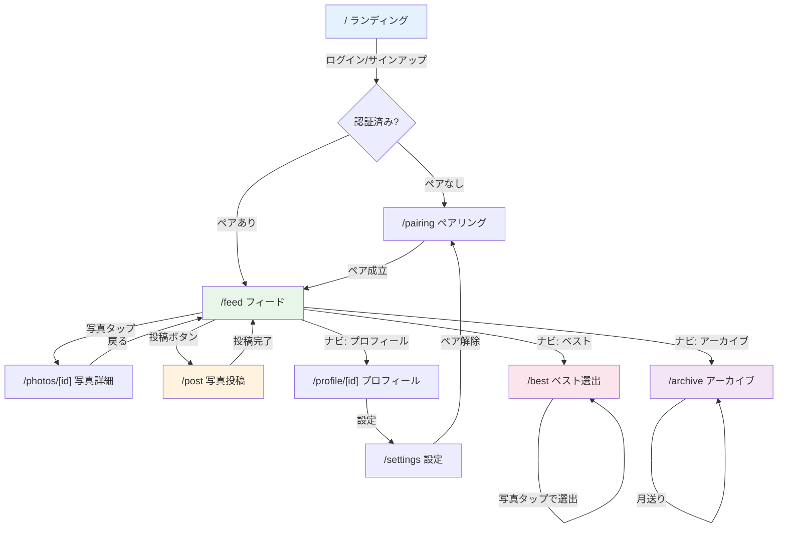

# Photop 画面設計書

## 1. 画面遷移図



---

## 2. ボトムナビゲーション構成

```
┌──────────────────────────────────────────────┐
│  🏠 フィード  │  📷 投稿  │  ⭐ ベスト  │  📚 アーカイブ  │  👤 プロフ  │
└──────────────────────────────────────────────┘
```

**MUIコンポーネント**: `BottomNavigation` + `BottomNavigationAction`

---

## 3. 各画面設計

### 3.1 ランディング画面 (`/`)

```
┌─────────────────────────────┐
│                             │
│         📸 Photop           │
│                             │
│   2人のための月間ベスト      │
│      フォトアプリ           │
│                             │
│  ┌───────────────────────┐  │
│  │ メールアドレス         │  │
│  └───────────────────────┘  │
│  ┌───────────────────────┐  │
│  │ パスワード             │  │
│  └───────────────────────┘  │
│                             │
│  ┌───────────────────────┐  │
│  │      ログイン          │  │
│  └───────────────────────┘  │
│                             │
│  アカウントがない方は       │
│  → サインアップ            │
│                             │
└─────────────────────────────┘
```

| 要素 | MUIコンポーネント | 備考 |
|------|-----------------|------|
| ロゴ・タイトル | `Typography` variant="h3" | アプリ名 + サブタイトル |
| メール入力 | `TextField` type="email" | バリデーション: メール形式 |
| パスワード入力 | `TextField` type="password" | 最低6文字 |
| ログインボタン | `Button` variant="contained" | `signInWithPassword` |
| サインアップリンク | `Link` / `Button` variant="text" | サインアップフォームへ切替 |

**使用API**: `supabase.auth.signInWithPassword()` / `supabase.auth.signUp()`

---

### 3.2 ペアリング画面 (`/pairing`)

```
┌─────────────────────────────┐
│ ← Photop                   │
├─────────────────────────────┤
│                             │
│  ペアリングしよう！         │
│                             │
│  ┌─ 招待コードを作成 ─────┐ │
│  │                         │ │
│  │  [ コードを生成する ]   │ │
│  │                         │ │
│  │   A B C 1 2 3           │ │
│  │   有効期限: 24時間      │ │
│  │   [ コピー ]            │ │
│  └─────────────────────────┘ │
│                             │
│  ─── または ───             │
│                             │
│  ┌─ 招待コードを入力 ─────┐ │
│  │                         │ │
│  │  ┌───────────────────┐  │ │
│  │  │ 6桁のコードを入力  │  │ │
│  │  └───────────────────┘  │ │
│  │  [ 参加する ]           │ │
│  └─────────────────────────┘ │
│                             │
└─────────────────────────────┘
```

| 要素 | MUIコンポーネント | 備考 |
|------|-----------------|------|
| コード生成ボタン | `Button` | RPC `generate_invite_code` 呼出 |
| 生成されたコード | `Typography` variant="h4" | 大きく表示 |
| コピーボタン | `IconButton` + `ContentCopy` | クリップボードにコピー |
| コード入力 | `TextField` | 6文字制限、英数字 |
| 参加ボタン | `Button` variant="contained" | RPC `join_pair` 呼出 |
| 区切り | `Divider` | 「または」テキスト付き |

**使用API**: `supabase.rpc('generate_invite_code')` / `supabase.rpc('join_pair', { code })`

---

### 3.3 フィード画面 (`/feed`)

```
┌─────────────────────────────┐
│ 📸 Photop        [相手アバター] │
├─────────────────────────────┤
│                             │
│ ┌───────────────────────┐   │
│ │ 🟢 ユーザー名         │   │
│ ├───────────────────────┤   │
│ │                       │   │
│ │                       │   │
│ │     [写真画像]        │   │
│ │     (正方形クロップ)   │   │
│ │                       │   │
│ ├───────────────────────┤   │
│ │ ❤️  💬               │   │
│ │ キャプションテキスト   │   │
│ │ 2時間前               │   │
│ └───────────────────────┘   │
│                             │
│ ┌───────────────────────┐   │
│ │ 🟢 ユーザー名         │   │
│ │ ... (次の写真カード)   │   │
│ └───────────────────────┘   │
│                             │
├─────────────────────────────┤
│ 🏠  📷  ⭐  📚  👤       │
└─────────────────────────────┘
```

| 要素 | MUIコンポーネント | 備考 |
|------|-----------------|------|
| ヘッダー | `AppBar` | アプリ名 + 相手のアバター |
| 写真カード | `Card` + `CardHeader` + `CardMedia` + `CardActions` + `CardContent` | Instagram風 |
| アバター | `Avatar` | ユーザーアイコン |
| いいねボタン | `IconButton` + `Favorite` | トグル式、赤/グレー |
| コメントボタン | `IconButton` + `ChatBubbleOutline` | 写真詳細へ遷移 |
| キャプション | `Typography` variant="body2" | 最大200文字 |
| 相対時間 | `Typography` variant="caption" | 「2時間前」等 |
| ボトムナビ | `BottomNavigation` | 5タブ |

**使用API**: `supabase.from('photos').select(...).eq('pair_id', pairId).order('created_at', { ascending: false })`

---

### 3.4 写真投稿画面 (`/post`)

```
┌─────────────────────────────┐
│ ← キャンセル    次へ/投稿   │
├─────────────────────────────┤
│                             │
│  ┌───────────────────────┐  │
│  │                       │  │
│  │                       │  │
│  │    [プレビュー画像]    │  │
│  │                       │  │
│  │                       │  │
│  └───────────────────────┘  │
│                             │
│  ┌───────────────────────┐  │
│  │ キャプションを入力...  │  │
│  │                       │  │
│  └───────────────────────┘  │
│  0/200                      │
│                             │
│  ┌───────────────────────┐  │
│  │    📷 写真を選択      │  │
│  └───────────────────────┘  │
│                             │
├─────────────────────────────┤
│ 🏠  📷  ⭐  📚  👤       │
└─────────────────────────────┘
```

| 要素 | MUIコンポーネント | 備考 |
|------|-----------------|------|
| ヘッダー | `AppBar` | キャンセル + 投稿ボタン |
| 画像プレビュー | `Box` + `img` | 選択した画像のプレビュー |
| キャプション入力 | `TextField` multiline | 200文字制限 |
| 文字数カウント | `Typography` variant="caption" | 残り文字数表示 |
| 写真選択ボタン | `Button` + `input[type=file]` | accept: image/* |

**使用API**: `supabase.storage.from('photos').upload(...)` → `supabase.from('photos').insert(...)`

---

### 3.5 写真詳細画面 (`/photos/[photoId]`)

```
┌─────────────────────────────┐
│ ← 戻る                 🗑️  │
├─────────────────────────────┤
│ 🟢 ユーザー名               │
├─────────────────────────────┤
│                             │
│    [写真画像]               │
│    (オリジナル比率)          │
│                             │
├─────────────────────────────┤
│ ❤️  💬  (いいね数)          │
│ キャプション                │
│ 2026/02/28 15:30            │
├─────────────────────────────┤
│ コメント一覧                │
│ ┌───────────────────────┐   │
│ │ 🟢 名前: コメント本文  │   │
│ │    3時間前             │   │
│ ├───────────────────────┤   │
│ │ 🟢 名前: コメント本文  │   │
│ │    1時間前             │   │
│ └───────────────────────┘   │
├─────────────────────────────┤
│ [コメントを入力...]   送信  │
└─────────────────────────────┘
```

| 要素 | MUIコンポーネント | 備考 |
|------|-----------------|------|
| 削除ボタン | `IconButton` + `Delete` | 自分の写真のみ表示 |
| 写真 | `Box` + `img` | オリジナル比率で表示 |
| いいねボタン | `IconButton` + `Favorite` | ダブルタップでもいいね可 |
| コメントリスト | `List` + `ListItem` | 時系列昇順 |
| コメント入力 | `TextField` + `IconButton` (Send) | 200文字制限 |

**使用API**: `supabase.from('photos').select(...).eq('id', photoId).single()` / いいね・コメントCRUD

---

### 3.6 ベスト選出画面 (`/best`)

```
┌─────────────────────────────┐
│ ⭐ 今月のベストを選ぼう     │
├─────────────────────────────┤
│                             │
│  📅 2026年2月               │
│                             │
│  相手の写真から1枚選んでね   │
│                             │
│  ┌─────┐ ┌─────┐ ┌─────┐  │
│  │ 📷  │ │ 📷  │ │ 📷  │  │
│  │     │ │ ✅  │ │     │  │
│  └─────┘ └─────┘ └─────┘  │
│  ┌─────┐ ┌─────┐ ┌─────┐  │
│  │ 📷  │ │ 📷  │ │ 📷  │  │
│  └─────┘ └─────┘ └─────┘  │
│                             │
│  選出中: 「キャプション...」 │
│  [ 変更する ]               │
│                             │
├─────────────────────────────┤
│ 🏠  📷  ⭐  📚  👤       │
└─────────────────────────────┘
```

| 要素 | MUIコンポーネント | 備考 |
|------|-----------------|------|
| 月表示 | `Typography` | 現在の年月 |
| 説明テキスト | `Typography` variant="body2" | ガイダンス |
| 写真グリッド | `ImageList` cols={3} | 相手の今月の写真一覧 |
| 選出マーク | `Checkbox` overlay | チェックマーク表示 |
| 選出中表示 | `Alert` severity="success" | 現在の選出状況 |

**使用API**: `supabase.from('photos').select(...).neq('user_id', userId)` / `supabase.rpc('select_monthly_best', { p_photo_id })`

---

### 3.7 アーカイブ画面 (`/archive`)

```
┌─────────────────────────────┐
│ 📚 アーカイブ               │
├─────────────────────────────┤
│                             │
│  ◀ 2026年1月 ▶              │
│                             │
│  ┌──────────┬──────────┐    │
│  │ あなたが  │ 相手が   │    │
│  │ 選んだ    │ 選んだ   │    │
│  │ ベスト    │ ベスト   │    │
│  │          │          │    │
│  │  [写真]  │  [写真]  │    │
│  │          │          │    │
│  │ caption  │ caption  │    │
│  └──────────┴──────────┘    │
│                             │
│  ◀ 2025年12月 ▶             │
│  ┌──────────┬──────────┐    │
│  │  [写真]  │  [写真]  │    │
│  │ caption  │ caption  │    │
│  └──────────┴──────────┘    │
│                             │
├─────────────────────────────┤
│ 🏠  📷  ⭐  📚  👤       │
└─────────────────────────────┘
```

| 要素 | MUIコンポーネント | 備考 |
|------|-----------------|------|
| 月ナビ | `IconButton` (ChevronLeft/Right) + `Typography` | 月送り |
| ベストカード | `Card` × 2 横並び | `Grid` container で配置 |
| 写真 | `CardMedia` | 選ばれた写真 |
| キャプション | `CardContent` + `Typography` | 写真のキャプション |
| 未選出表示 | `Typography` color="text.secondary" | 「ベストなし」 |

**使用API**: `supabase.from('monthly_bests').select(...).eq('is_confirmed', true).eq('month', targetMonth)`

---

### 3.8 プロフィール画面 (`/profile/[userId]`)

```
┌─────────────────────────────┐
│ ← 戻る              ⚙️     │
├─────────────────────────────┤
│                             │
│         [アバター]          │
│        ユーザー名           │
│        投稿 42枚            │
│                             │
├─────────────────────────────┤
│ ┌─────┐ ┌─────┐ ┌─────┐   │
│ │ 📷  │ │ 📷  │ │ 📷  │   │
│ └─────┘ └─────┘ └─────┘   │
│ ┌─────┐ ┌─────┐ ┌─────┐   │
│ │ 📷  │ │ 📷  │ │ 📷  │   │
│ └─────┘ └─────┘ └─────┘   │
│ ┌─────┐ ┌─────┐ ┌─────┐   │
│ │ 📷  │ │ 📷  │ │ 📷  │   │
│ └─────┘ └─────┘ └─────┘   │
│                             │
├─────────────────────────────┤
│ 🏠  📷  ⭐  📚  👤       │
└─────────────────────────────┘
```

| 要素 | MUIコンポーネント | 備考 |
|------|-----------------|------|
| アバター | `Avatar` sx={{ width: 80, height: 80 }} | 大きめ表示 |
| ユーザー名 | `Typography` variant="h6" | display_name |
| 投稿数 | `Typography` variant="body2" | 写真の総数 |
| 写真グリッド | `ImageList` cols={3} | 正方形サムネイル |
| 設定ボタン | `IconButton` + `Settings` | 自分のプロフィールのみ表示 |

**使用API**: `supabase.from('profiles').select(...)` / `supabase.from('photos').select(...).eq('user_id', userId)`

---

### 3.9 設定画面 (`/settings`)

```
┌─────────────────────────────┐
│ ← 設定                     │
├─────────────────────────────┤
│                             │
│  プロフィール編集            │
│  ┌───────────────────────┐  │
│  │ 表示名                 │  │
│  └───────────────────────┘  │
│  ┌───────────────────────┐  │
│  │ アバター画像 [変更]    │  │
│  └───────────────────────┘  │
│  [ 保存 ]                   │
│                             │
│  ─────────────────────────  │
│                             │
│  ペア情報                   │
│  相手: ユーザー名           │
│  ペア開始日: 2026/01/15     │
│                             │
│  ┌───────────────────────┐  │
│  │   ⚠️ ペアを解除する    │  │
│  └───────────────────────┘  │
│                             │
│  ─────────────────────────  │
│                             │
│  [ ログアウト ]             │
│                             │
└─────────────────────────────┘
```

| 要素 | MUIコンポーネント | 備考 |
|------|-----------------|------|
| 表示名入力 | `TextField` | display_name 編集 |
| アバター変更 | `Avatar` + `Button` | Storageアップロード |
| 保存ボタン | `Button` variant="contained" | profiles UPDATE |
| ペア解除ボタン | `Button` variant="outlined" color="error" | 確認ダイアログ付き |
| ログアウトボタン | `Button` variant="text" | `supabase.auth.signOut()` |
| 確認ダイアログ | `Dialog` | ペア解除の確認 |

**使用API**: `supabase.from('profiles').update(...)` / `supabase.from('pairs').update({ status: 'dissolved' })`
