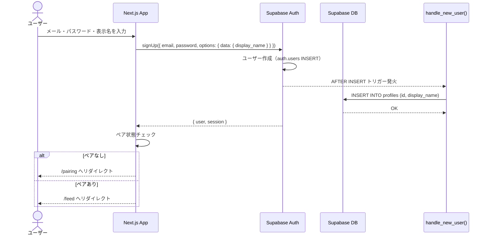
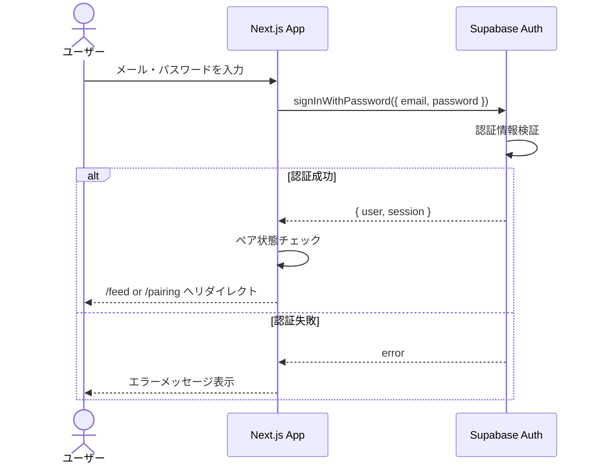
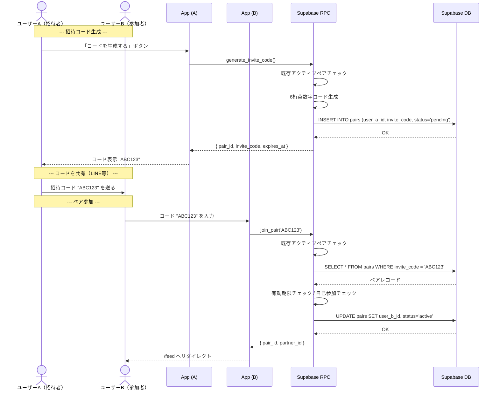
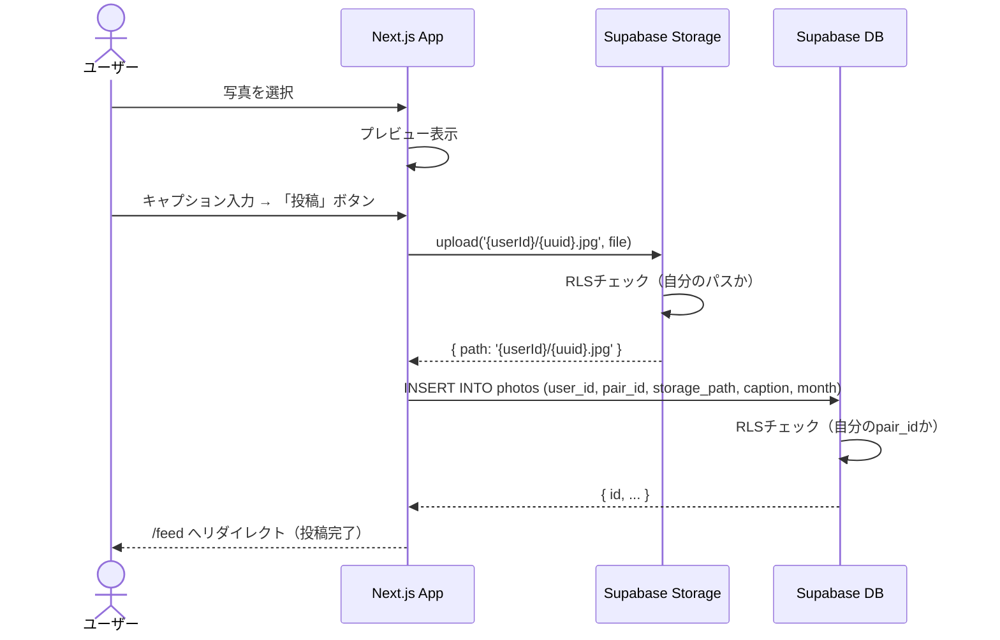
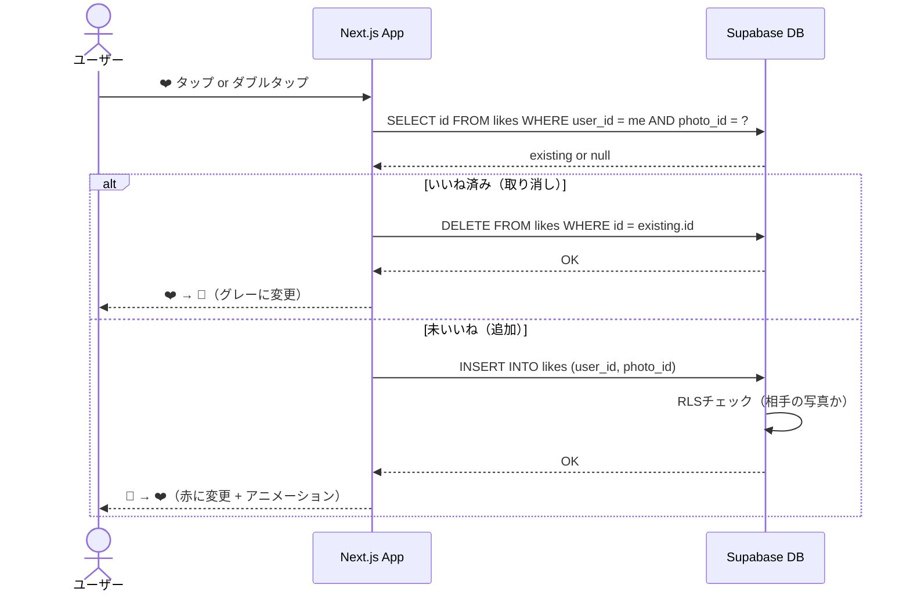
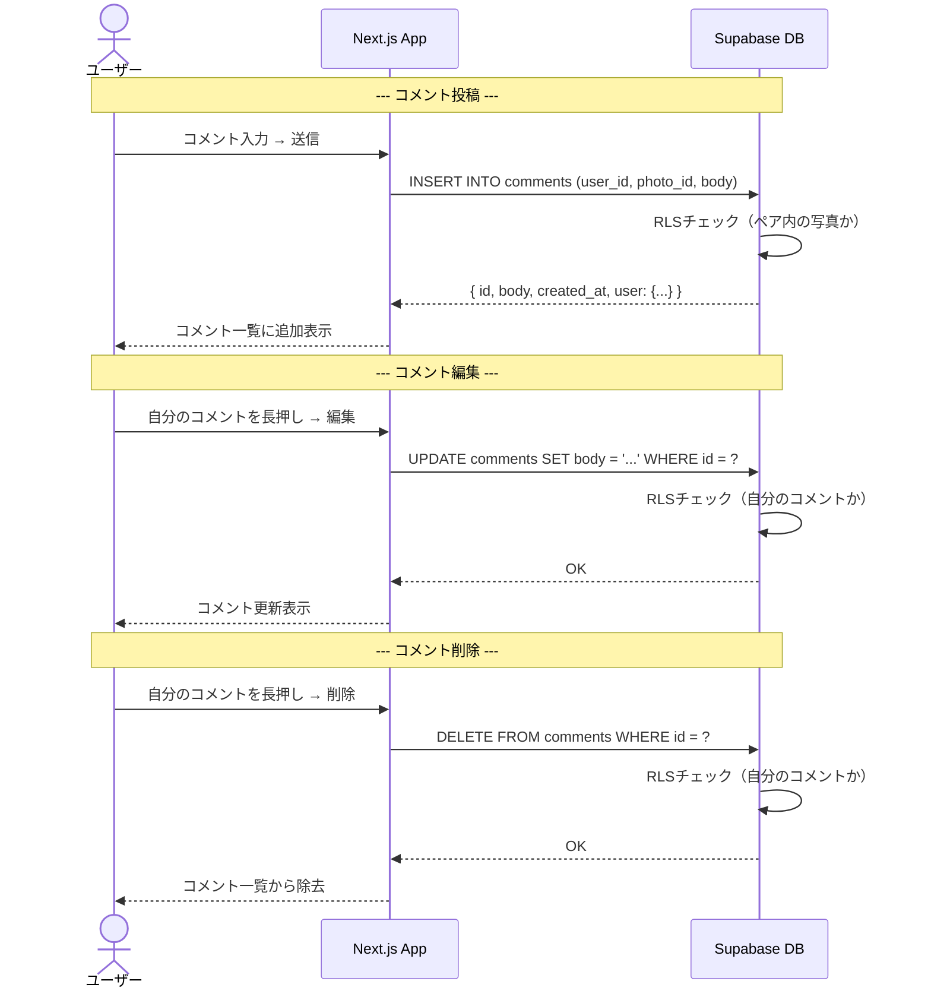
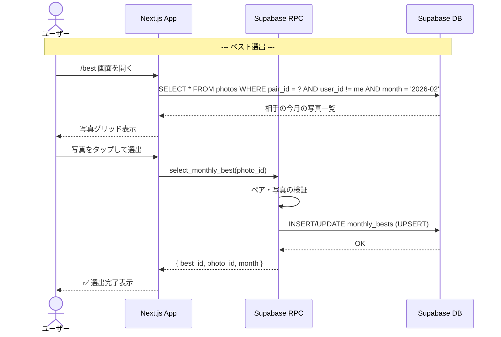
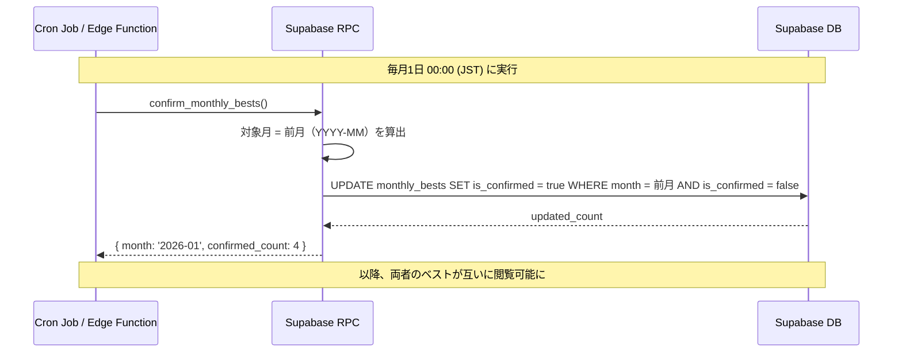
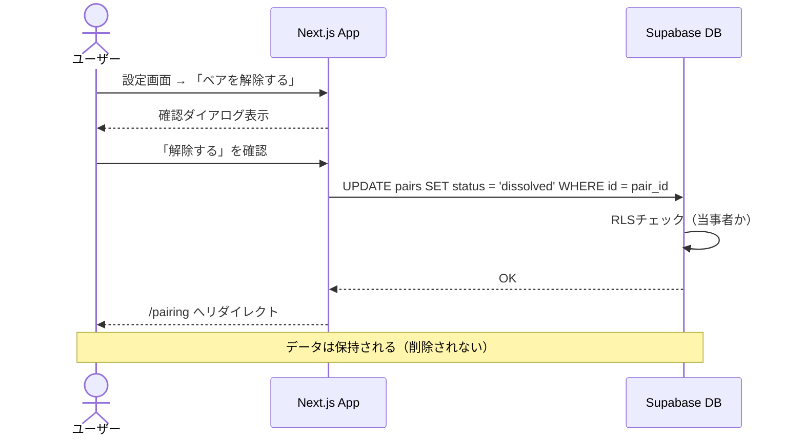

# Photop シーケンス図

主要なユーザーフローをシーケンス図で示す。

---

## 1. 認証フロー（サインアップ）

---

## 2. 認証フロー（ログイン）

---

## 3. ペアリングフロー（招待コード生成 → 参加）

---

## 4. 写真投稿フロー

---

## 5. いいねフロー（トグル）

---

## 6. コメントフロー

---

## 7. 月間ベスト選出フロー

---

## 8. 月間ベスト自動確定フロー（Cron）

---

## 9. ペア解除フロー

